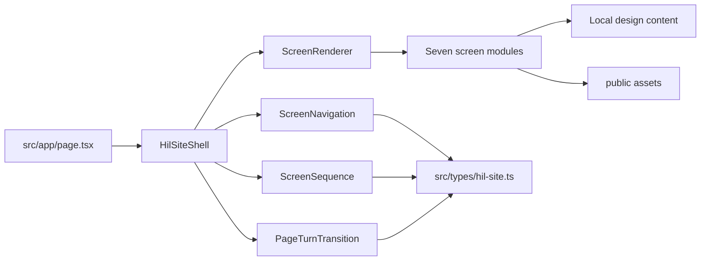
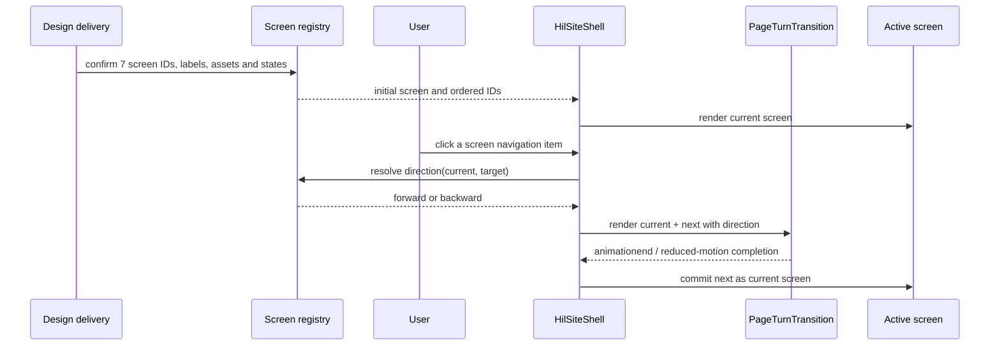

# Harmonizing Intelligence Lab：Figma 单 URL 七画面前端架构

状态：已确认的 redesign 目标架构

范围：当前仓库的官网前端，以及同一 URL 下的 7 个设计画面。当前权威是尚未收到的 Photoshop 分层原稿、全尺寸 sRGB PNG、随附素材/字体/状态说明及其 Ticket 001 清单；Figma 只保留历史 provenance 与恢复访问后的辅助核对用途。

## Current state

当前仓库是一个处于 rehabilitation active 状态的 Next.js 16 前端壳层：

- `src/app/page.tsx` 只有首页占位文案。
- `src/app/layout.tsx` 只有基础 metadata、viewport 和全局样式入口。
- `src/app/globals.css` 只有基础颜色、字体和占位页样式。
- `src/components/ui/button.tsx` 和 `src/lib/utils.ts` 是现有 UI 基础设施，但当前没有页面消费者证明它们已经覆盖 HIL 视觉需求。
- `public/` 没有正式官网资源。
- `package.json`、`package-lock.json`、`next.config.ts`、`tsconfig.json`、ESLint、PostCSS 等工具链文件已在用户明确授权后从 `HEAD` 恢复；`node_modules` 当前不存在，尚未声明前端校验通过。
- `make test-guardrails` 与 `make check-guardrails` 已通过；安装依赖后再运行完整 `make check`。
- 同级归档目录存在历史官网、图片和研究资料，但它们只允许作为参考，不进入当前运行时。

Figma 历史来源中已观察到 HOME 节点 `MASTER / HOME / Exact 1:1 Approved PNG`。正式实现必须等待 Ticket 001 验收 Photoshop 原稿及 PNG；整页 PNG 只作视觉 oracle，随附图片/SVG 才能作为候选媒体，再用语义 HTML 重建文本和交互区域。

## Findings by lens

| What | Why | Effort |
| --- | --- | --- |
| 当前 `/` 占位入口 | 页面没有真实结构，无法承载 7 个画面状态或交互；但它也没有历史实现包袱，适合直接建立唯一正式入口。 | low |
| 现有 `components/ui/button.tsx` | 它是通用基础设施，不等于 HIL 页面组件。现在强行围绕它搭完整设计系统会把 Figma 视觉差异藏进错误的抽象。 | low |
| `src/` 当前目录 | 项目是单一官网展示边界，没有复杂业务规则、多入口或后端集成；套用 DDD、Clean Architecture、domain/application/infrastructure 会增加目录和依赖，而不会减少页面复杂度。 | medium |
| 七张 Figma 图与 URL 的关系 | 七张图不是七条业务路由，而是同一 URL 下的 7 个画面状态。若按路由拆分，翻页动效、当前状态和导航会被迫跨路由协调。 | medium |
| 归档官网与当前运行时 | 归档内容包含其他项目和旧实现，直接复制会产生第二套页面、文案来源漂移和资源边界污染。 | medium |
| 当前验证工具链 | 依赖尚未安装，且运行时和 Playwright 验证入口尚未补齐；只能先完成架构和护栏检查，安装依赖后再做前端与视觉证据。 | high |

## Recommendations

### Scope & goals

目标是把 Ticket 001 确认的 7 个画面实现为一个可运行的 Next.js 单页体验：

- 视觉、文案、布局、响应式状态和交互状态与 Photoshop 交付清单保持一致。
- 点击导航或子页面入口时，在同一个 URL 内切换画面，并播放设计交付要求的整页翻页式过渡。
- 每个画面拥有独立的实现文件和局部内容，避免形成七套拷贝或一个数百行条件组件。
- 只使用本地静态数据和 `public/` 资源，不引入后端、数据库、CMS、账号体系或全局状态管理。
- 通过桌面、移动端和减少动画三类可观察状态验收。

明确不做：

- 不把 7 个画面建成 7 个独立路由。
- 不把整页 PNG 当作最终网页，只把它当视觉参照；文本、导航和可交互区域使用真实 HTML。
- 不把 `../labWebSite-archive/` 作为运行时 import 来源。
- 不为了架构完整而新增领域层、应用层、仓储层或 API 层。

### Module map

#### 1. `HilSiteShell`

接口：`<HilSiteShell />`，由 `src/app/page.tsx` 调用。

它隐藏页面导航、当前状态、切换方向、过渡锁、画面渲染和可访问性属性。调用方不需要知道七个画面如何组织，也不需要管理动画时序。

深度：入口极小，但集中承载整个单页体验的编排复杂度；删除它会把当前画面、导航和过渡控制散落回 `page.tsx`。

#### 2. `ScreenSequence`

接口：

```ts
type ScreenId = string;
type TransitionDirection = "forward" | "backward";

type ScreenSequence = {
  initial: ScreenId;
  ids: readonly ScreenId[];
  direction(from: ScreenId, to: ScreenId): TransitionDirection;
};
```

它是纯 TypeScript 模块，负责 7 个画面状态的稳定顺序、初始画面和前进/后退判断；不依赖 React、Next.js、DOM 或动画库。

深度：导航组件只需要给它两个 `ScreenId`，不需要各自重复比较索引、处理非法状态或维护方向规则。

#### 3. `ScreenRenderer`

接口：根据当前 `ScreenId` 返回唯一对应的画面实现。

它隐藏 `ScreenId -> screen module` 的映射，保证每个画面只有一个正式实现。七个画面可以各自拥有局部布局，但不能在页面入口中复制条件树。

深度：未来 Figma 调整某一个画面时，只需要触碰对应画面模块和它的资源，不影响导航状态机。

#### 4. `PageTurnTransition`

接口：

```tsx
<PageTurnTransition
  currentKey={currentScreen}
  nextKey={nextScreen}
  direction={direction}
  onComplete={commitNextScreen}
>
  {currentView}
  {nextView}
</PageTurnTransition>
```

它隐藏当前画面和下一画面的双层渲染、CSS class/data attribute、动画完成提交、过渡期间的点击锁定和 `prefers-reduced-motion` 处理。

深度：七个画面不需要知道翻页如何实现；设计交付改变翻页方向、遮罩、缓动或层叠关系时，只改这一处。

#### 5. `ScreenNavigation`

接口：接受 `items`、`activeId`、`disabled` 和 `onSelect(id)`。

它只表达导航视觉和可访问性，不直接修改 URL、不读取浏览器历史、不操作动画 DOM。它通过 `aria-current`、键盘焦点和按钮语义表达当前画面。

#### 6. 七个画面模块

每个画面是独立的 React 模块，命名以 Ticket 001 的 Photoshop 画面名称为准。名称未确认前保持本票阻塞，不把临时命名带进正式实现。

画面模块只负责自己的语义 HTML、局部布局和局部资源，不负责全局导航、不负责切换方向、不负责读取 Figma API。

### Dependency rules

依赖方向如下：



规则：

- `src/types/` 不依赖 React、Next.js 或 DOM。
- `src/lib/hil-site/` 中的 `ScreenSequence` 只做纯状态计算，不导入 UI 框架。
- `src/components/hil-site/` 可以依赖 `src/types/` 和 `src/lib/`，反向禁止。
- `src/app/` 只负责 Next.js 入口、metadata、全局 CSS 和组合，不承载七个画面的业务/视觉细节。
- 画面组件可以读本地静态内容，但不能 import 归档目录、调用外部 API 或创建全局 store。
- `public/` 是静态资源边界，不被 TypeScript 模块反向依赖为数据层。
- 只有真实存在两个以上消费者时，才把视觉组件提到共享组件；单个画面的局部元素留在画面模块内部。

### Directory structure

```text
src/
├── app/
│   ├── globals.css                  # reset、设计 token、全局响应式基础
│   ├── layout.tsx                   # metadata、viewport、根布局
│   └── page.tsx                     # 唯一 URL 入口，只渲染 HilSiteShell
├── components/
│   ├── hil-site/
│   │   ├── HilSiteShell.tsx         # 单页状态编排
│   │   ├── ScreenNavigation.tsx     # 导航和当前态
│   │   ├── PageTurnTransition.tsx   # 整页翻页过渡
│   │   ├── ScreenRenderer.tsx       # ScreenId 到画面模块的唯一映射
│   │   └── screens/                 # 7 个独立画面实现
│   │       ├── HomeScreen.tsx
│   │       ├── ...
│   │       └── ...
│   └── ui/                          # 只有被多个画面真实复用的基础组件
├── hooks/
│   └── useHilScreen.ts              # 仅在状态编排需要 React hook 时存在
├── lib/
│   ├── hil-site/
│   │   └── screen-sequence.ts       # 纯状态顺序和方向判断
│   └── utils.ts
└── types/
    └── hil-site.ts                  # ScreenId、方向和共享展示类型

public/
└── images/
    └── hil-site/                    # Ticket 001 确认的正式图片/SVG/字体资源

docs/
├── adr/
├── architecture/
└── design-references/               # 仅放视觉核对资料，不被运行时读取
```

目录中的 `HomeScreen` 和省略号只是结构示意；实现时以 Ticket 001 的真实画面名称和页面内容替换，不创建 `_v1`、`_new` 等并行副本。

### Data flow



运行时切换规则：

1. 初始进入 `/` 时显示 Ticket 001 指定的首个画面。
2. 点击当前画面时不触发动画。
3. 点击其他画面时先计算方向，再同时渲染当前画面和下一画面。
4. 过渡期间锁定重复点击，避免两个动画互相覆盖。
5. 动画完成后只保留下一画面，提交 `currentScreen`。
6. 开启减少动画时直接提交状态，保持内容可访问。

## Decisions

- 采用单 URL 七画面序列，记录于 [ADR 0001](../adr/0001-single-url-screen-sequence.md)。
- 采用 React 状态 + 原生 CSS 翻页过渡，记录于 [ADR 0002](../adr/0002-native-css-page-transition.md)。
- 采用 feature-first 的展示层结构，不引入 DDD、Clean Architecture、后端端口或全局状态管理；这是由“单一官网、单一 URL、纯展示交互”决定的最小结构。
- Ticket 001 的 Photoshop 画面、状态和正式资源先于视觉代码；没有设计交付证据的视觉或交互不主动扩展。
- 实现顺序固定为：安装并验证前端工具链 → 验收 Photoshop 原稿/PNG/随附清单 → 完成 Ticket 001 → 搭建单页壳与过渡 → 实现 7 个画面 → 做响应式和动效验收。

## Open questions

这些是收到 Photoshop 原始交付包后由 Ticket 001 确认的事实：

- 7 个画面的源文件或画板、名称、桌面/移动尺寸和连接关系。
- 翻页动效的方向、时长、缓动、遮罩和层叠状态；设计稿未提供明确值时使用规格中的默认 token。
- 哪些图片/Logo 是随附原始资源，哪些只是整页 PNG 的视觉结果；前者进入 `public/images/hil-site/`，后者只作为比对参照。
- 依赖安装完成后，先以哪一个页面状态作为视觉实现基线。

## Delivery evidence

正式实现完成后，最小证据集为：

- `make test-guardrails`
- `make check-guardrails`
- `make check`
- `/` 在桌面和移动视口的 7 个画面截图对照
- 7 个画面之间的点击切换、键盘操作、动画完成和 `prefers-reduced-motion` 证据
- 每个截图和交互证据注明对应的 Photoshop 画面或状态，并在适用时附 Figma provenance
